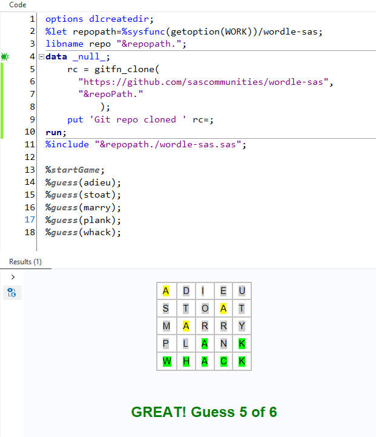

# Programming the Wordle game in SAS

I created this as a fun excerise to emulate the popular game Wordle in the SAS language.

Some features:
 * uses the "official" word lists from New York Times as curated by [cfreshman](https://github.com/cfreshman)
 * also verifies guesses as "valid" using the list of allowed guesses, again curated by [cfreshman](https://github.com/cfreshman)
 * uses DATA step array to verify guesses against solution word. Other approaches might be to use hash object or SAS/IML, both of which would probably result in smaller code.

To play:
 
 1. Submit the [wordle-sas.sas](./wordle-sas.sas) program in your SAS session. This program should work in PC SAS, SAS OnDemand for Academics, SAS Enterprise Guide, and SAS Viya.

    The program will fetch word lists from GitHub and populate into data sets. It will also define two macros you will use to play the game.

 1. Start a game by running:
     ```
     %startGame;
     ```
    This will select a random word from the word list as the "puzzle" word and store it in a SAS macro variable (don't peek!)

 1. Optionally seed a game with a known word by using and optional 5-character word parameter:
     ```
     %startGame(crane);
     ```

     This will seed the puzzle word ("crane" in this example). It's useful for testing. See a battery of test "sessions" in [wordle-sas-tests.sas](./wordle-sas-tests.sas)

 1. Submit a guess by running:
      ```
     %guess(adieu);
     ```

     This will check the guess against the puzzle word, and it wll output a report with the familiar "status" - letters that appear in the word (yellow) and that are in the correct position (green). It will also report if the guess is not a valid guess word, and it won't count that against you as one of your 6 permitted guesses.

     The program keeps track of your guesses and when you solve it, it shares the familiar congratulatory message that marks the end of a Wordle session.

## Start a fresh game using Git functions

If you don't want to look at or copy/paste the code, you can use Git functions in SAS to bring the program into your SAS session and play. (Requires SAS 9.4 Maint 6 or later, or SAS Viya)

```
options dlcreatedir;
%let repopath=%sysfunc(getoption(WORK))/wordle-sas;
libname repo "&repopath.";
data _null_;
    rc = gitfn_clone( 
      "https://github.com/sascommunities/wordle-sas", 
      "&repoPath." 
    			); 
    put 'Git repo cloned ' rc=; 
run;
%include "&repopath./wordle-sas.sas";

/* start a game and submit first guess */
%startGame;
%guess(adieu);
```


